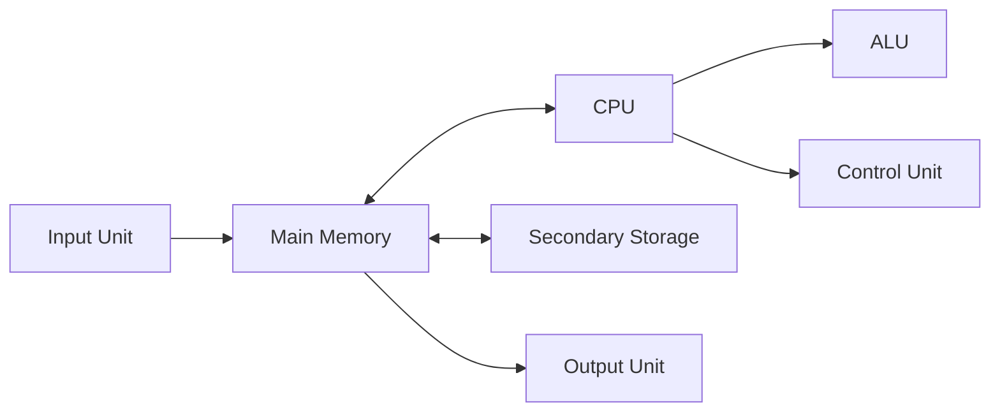

# Computer System Block Diagram

```mermaid
flowchart LR
    I[Input Unit] --> M[Main Memory]
    M <--> C[CPU]
    C --> A[ALU]
    C --> CU[Control Unit]
    M <--> S[Secondary Storage]
    M --> O[Output Unit]
```
