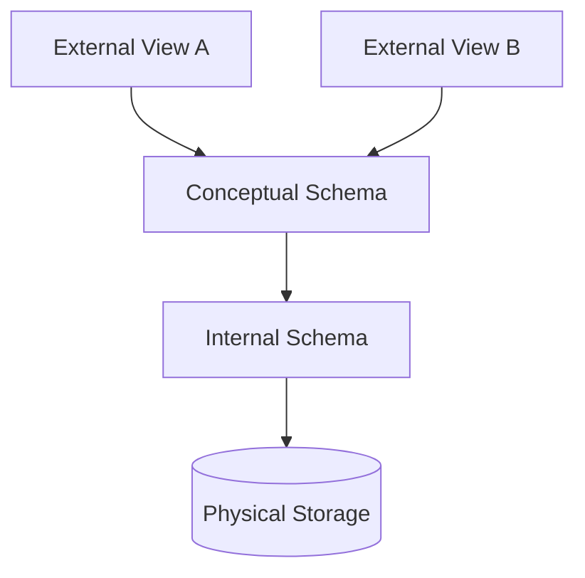

# Three-Schema Database Architecture

```mermaid
flowchart TB
    U1[External View A] --> C[Conceptual Schema]
    U2[External View B] --> C
    C --> I[Internal Schema]
    I --> P[(Physical Storage)]
```
