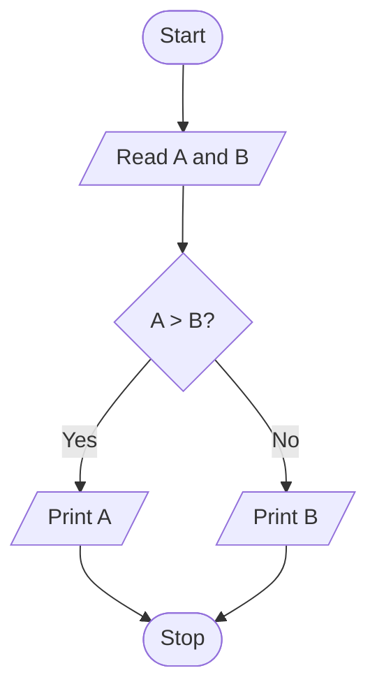

# Flowchart: Maximum of Two Numbers

```mermaid
flowchart TD
    A([Start]) --> B[/Read A and B/]
    B --> C{A > B?}
    C -- Yes --> D[/Print A/]
    C -- No --> E[/Print B/]
    D --> F([Stop])
    E --> F
```
